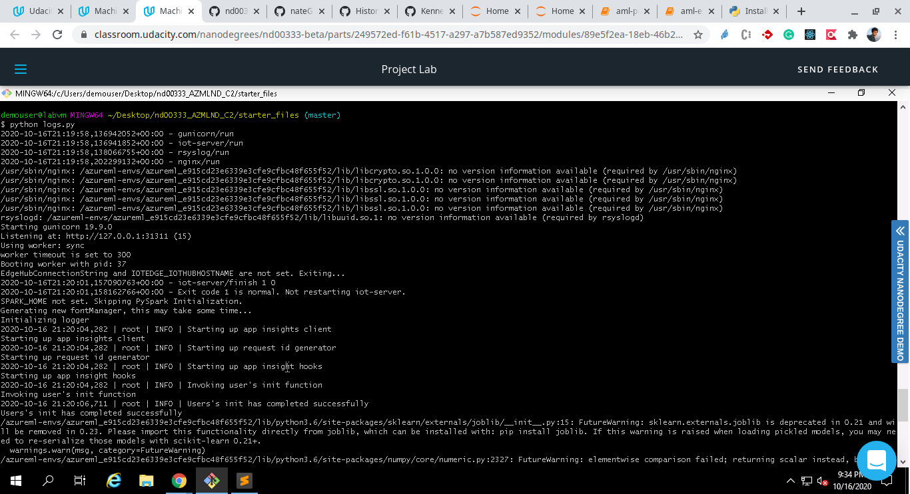

# Operationalizing Machine Learning

With a help of a Bank marketing dataset, a ML model is created to predict if customers will avail term deposit, based on oyher parameters available for customers.  
Here is a brief overview of what is estabilished:
1. A model is trained using AutoML
2. the model is deployed as a REST endpoint.
3. The pipeline is created for the same.

## Improvements

Use of neural networks and training of the model with more compute and more training time can be of help in achieving a better accuracy.

## Architectural Diagram

## Key Steps

We'd first need to make sure that we have the [Bankmarketing dataset](https://automlsamplenotebookdata.blob.core.windows.net/automl-sample-notebook-data/bankmarketing_train.csv) in our registered datasets. As soon as we upload it, we' be able to see the bankmarketing dataset is present in the registered datasets:

In the Azure ML studio, we need to create a new Automated ML run. Along with that, We need to configure a new compute cluster. For our experiment we choose `Standard_DS12_v2` as the cluster-type/virtual-machine-size and we'd select `1` as the number of minimum nodes and `5` as the number of maximum nodes. The experiment uses `Classification` as an algorithm(column used for classification: `y`) and `Explain best model` is chosen as a metric. On Exit criterion, the default 3 hours is reducted to to an hour and concurrency is modified from the default value to `5`.

The AutoML experiment is completed and the best model turns out to be `VotingEnsemble` after conducting the experiment:

We choose the best model for deployment and enable "Authentication" while deploying the model using Azure Container Instance (ACI).
The requirements to execute `logs.py` script are installed and configured in a newly created virtual environment with Python3: `az`, Python SDK for Azure, python-pip packages: `azureml`, `azureml.core`.
The executed code in `logs.py` enables `Application Insights`.
"Application Insights enabled" is disabled before executing `logs.py`.

Executing `logs.py`: which is responsible for enabling "Application Insights enabled".

"Application Insights enabled" is disabled before executing `logs.py`.

Application Insights enabled" is enabled before executing `logs.py`.

The `swagger.json` file is downloaded for the deployed endpoint. The `swagger.sh` is executed to run the docker container for Swagger UI.
Here is the representation of the Swagger UI hosted on port 9000 of `localhost` with the Docker container: 

The `serve.py` is executed to host `swagger.json` file, which serves as an input in swagger UI.
The swagger instance, which is running with the documentation for the HTTP API of the model, further displays the contents of the API for the model. Representation of methods in Swagger UI are represented here:

Execute the `endpoint.py` file script runs against the API producing JSON output from the model.
Representation of the execution of `endpoint.py` to fetch the desired JSON response, which translates to consumption of endpoints here:

(OPTIONAL) Executing `benchmark.sh`, which shows if the endpoint adheres a certain benchmark:

The Jupyter Notebook `aml-pipelines-with-automated-machine-learning-step.ipynb` is uploaded to the Azure ML studio and all the cells are made to run, out of which one of the steps involve explicit authentication.
We verify that the pipeline has been created and shows in Azure ML studio, in the `Pipelines` section here:

Here are the pipeline endpoints:

Representation of the Bankmarketing dataset with AutoML module:

The published pipeline overview shows that the pipeline is ACTIVE:

The published pipeline overview shows that the pipeline is COMPLETED:

The execution of `RunDetails` widget in Notebook, along with Python SDK:

We further verify that the pipeline has been scheduled to run or is running:

## Screen Recording
Two screencasts has been uploaded to YouTube: 

1. [Screencast Part 1](https://youtu.be/M8ON4RzZuWI)

1. [Screencast Part 2](https://youtu.be/1epzibJTZBs)
