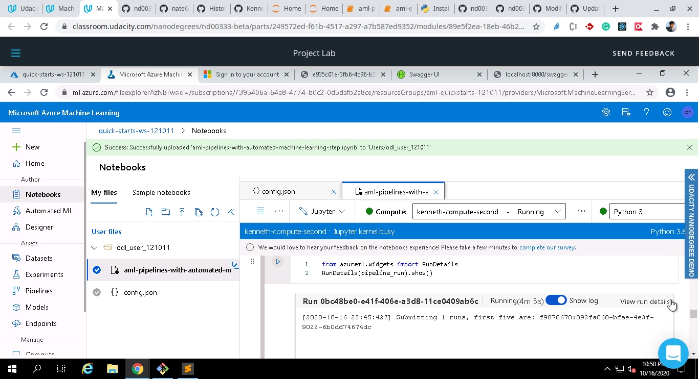

# Operationalizing Machine Learning

With a help of a Bank marketing dataset, a ML model is created to predict if customers will avail term deposit, based on oyher parameters available for customers.  
Here is a brief overview of what is estabilished:
1. A model is trained using AutoML
2. the model is deployed as a REST endpoint.
3. The pipeline is created for the same.

## Improvements

Use of neural networks and training of the model with more compute and more training time can be of help in achieving a better accuracy.

## Architectural Diagram

## Key Steps

The bankmarketing dataset is present in the registered datasets:

An autoML experiment is completed. The column used for classification: `y`

The best model turns out to be `VotingEnsemble` after conducting the experiment:

"Application Insights enabled" is disabled before executing `logs.py`.

Executing `logs.py`: which is responsible for enabling "Application Insights enabled".

"Application Insights enabled" is disabled before executing `logs.py`.

Application Insights enabled" is enabled before executing `logs.py`.

Then, the Swagger UI hosted on port 9000 of `localhost` with the Docker container: 

Representation of methods in Swagger UI are represented here:

Executing `endpoint.py` to fetch the desired JSON response, which translates to consumption of endpoints here:

(OPTIONAL) Executing `benchmark.sh`, which shows if the endpoint adheres a certain benchmark:

The pipeline is created using the scripts in Notebook and here is representation of a completed pipeline:

Here are the pipeline endpoints:

Representation of the Bankmarketing dataset with AutoML module:

The published pipeline overview shows that the pipeline is finished(which further corresponds to an ACTIVE status):

The execution of `RunDetails` widget in Notebook, along with Python SDK:

Representation of the scheduled run of Pipeline in ML studio:

## Screen Recording
The screencast has been uploaded to YouTube: [Screencast](https://youtu.be/M8ON4RzZuWI)
